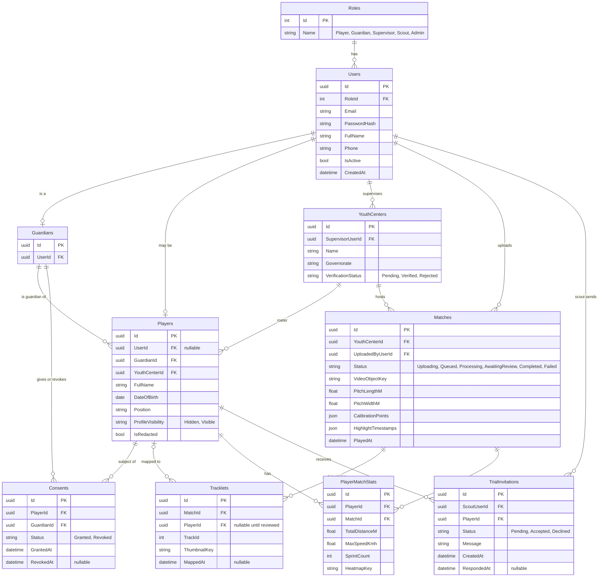

```mermaid
erDiagram
    Roles ||--o{ Users : "has"
    Users ||--o| Guardians : "is a"
    Users ||--o| Players : "may be"
    Users ||--o{ YouthCenters : "supervises"
    Guardians ||--o{ Players : "is guardian of"
    YouthCenters ||--o{ Players : "roster"
    YouthCenters ||--o{ Matches : "hosts"
    Users ||--o{ Matches : "uploads"
    Players ||--o{ Consents : "subject of"
    Guardians ||--o{ Consents : "gives or revokes"
    Matches ||--o{ Tracklets : "detected in"
    Players |o--o{ Tracklets : "mapped to"
    Players ||--o{ PlayerMatchStats : "has"
    Matches ||--o{ PlayerMatchStats : "produces"
    Users ||--o{ TrialInvitations : "scout sends"
    Players ||--o{ TrialInvitations : "receives"

    Roles {
        int Id PK
        string Name "Player, Guardian, Supervisor, Scout, Admin"
    }
    Users {
        uuid Id PK
        int RoleId FK
        string Email
        string PasswordHash
        string FullName
        string Phone
        bool IsActive
        datetime CreatedAt
    }
    YouthCenters {
        uuid Id PK
        uuid SupervisorUserId FK
        string Name
        string Governorate
        string VerificationStatus "Pending, Verified, Rejected"
    }
    Guardians {
        uuid Id PK
        uuid UserId FK
    }
    Players {
        uuid Id PK
        uuid UserId FK "nullable"
        uuid GuardianId FK
        uuid YouthCenterId FK
        string FullName
        date DateOfBirth
        string Position
        string ProfileVisibility "Hidden, Visible"
        bool IsRedacted
    }
    Consents {
        uuid Id PK
        uuid PlayerId FK
        uuid GuardianId FK
        string Status "Granted, Revoked"
        datetime GrantedAt
        datetime RevokedAt "nullable"
    }
    Matches {
        uuid Id PK
        uuid YouthCenterId FK
        uuid UploadedByUserId FK
        string Status "Uploading, Queued, Processing, AwaitingReview, Completed, Failed"
        string VideoObjectKey
        float PitchLengthM
        float PitchWidthM
        json CalibrationPoints
        json HighlightTimestamps
        datetime PlayedAt
    }
    Tracklets {
        uuid Id PK
        uuid MatchId FK
        uuid PlayerId FK "nullable until reviewed"
        int TrackId
        string ThumbnailKey
        datetime MappedAt "nullable"
    }
    PlayerMatchStats {
        uuid Id PK
        uuid PlayerId FK
        uuid MatchId FK
        float TotalDistanceM
        float MaxSpeedKmh
        int SprintCount
        string HeatmapKey
    }
    TrialInvitations {
        uuid Id PK
        uuid ScoutUserId FK
        uuid PlayerId FK
        string Status "Pending, Accepted, Declined"
        string Message
        datetime CreatedAt
        datetime RespondedAt "nullable"
    }
```
